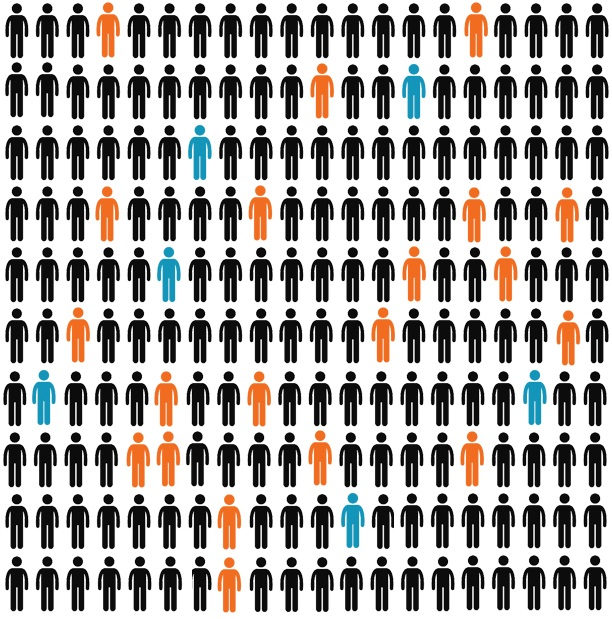
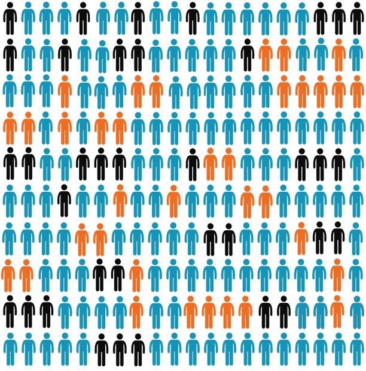

```{r setup, include=FALSE}
knitr::opts_chunk$set(echo = TRUE)

#Install these:
#install.packages("devtools")
#devtools::install_github("ijlyttle/vembedr")

library(dplyr)
library(DT)
library(devtools)
library(vembedr)

survey <- readxl::read_xlsx("03 Survey Instrument.xlsx")

survey <- subset(survey, 
		label!=is.na(label) & 
		label!="." &
        label!=">" &
        label!="Specify other:")

```

# Introduction
Hundreds of thousands of irregular migrants from sub-Saharan Africa attempted to reach Europe over the last decade, a trend likely to continue in the near future [@hanson2016mediterranean;@UNDP]. A sizable proportion comes from Nigeria, where a combination of enduring low-intensity violence, routine crime and a lagging economy [@WB] pushes people to migrate. Subnationally, the states of Edo and Delta, in the country's South-South region, are prominent for the number of young population intending to get to Europe. According to data from our pilot in Benin City, capital of Edo state, nearly one in four households had one member attempt irregular migration in the past year.

A considerable number of Nigerians decide to "follow land" to Europe "through routes": a complex trip from Nigeria to the Mediterranean sea through the Sahara desert via Niger and Lybia. In this path, migrants are often subjects of human trafficking, injuries, sexual violence, and even death. Furthermore, reaching the Mediterranean coast is far from the end of the journey. The International Office for Migration (IOM) estimates that as many as 100,000 Nigerian migrants are currently stranded in Libyan prisons awaiting repatriation. Many others have died at sea.

The minority that finally arrive to Europe face more difficulties. Destination countries have made it extremely difficult for sub-Saharan African migrants to take up legal residence, employment or even refugee status. They also invest heavily in programs to halt migration [@euprojects]. 

Recently, European governments began to fund a wide variety of campaings in origin countries aimed at deterring potential migrants. These campaings focus on providing information about the risks and costs of irregular migration and the supposed lack of benefits upon arrival in the destination country. However, these efforts lack an assesment of its effects on the beliefs of potential migrants. On top of that, the campaings assume the prevalence of misinformation about the costs and potential benefits of migrating to Europe, as well as the threats and dangers along the Mediterranean route. 

Are potential migrats uninformed or misinformed? Do information provision disuades migration? To answer these questions we field a baseline survey in which we embed an experimental component that provides a set of treated households with a realistic summary of the risks of irregular migration. Treatment is delivered in the form of an in-person script and a video message with testimonials from returned migrants. We emphasize the threats of the journey by land, in order to explicitly discourage potential migrants to embark in this life-threatening journey. 

This registration document details the first intervention of a bigger project described in a [later section](#arms). Enumerator recruitment and training ofr this arm of the project was carried out in October and November 2019, and survey implementation began on November 26, 2019, under the direct supervision of the researchers. Enumeration is ongoing as of the filing of this pre-analysis plan. Intermediate unweighted item-specific distributions were monitored and analyzed by researchers prior to registration. This registration and pre-analysis plan precede researcher access to the complete set of outcome data as well as any other analysis, including any correlational or regression analysis.

# Intervention

## Treatment
The treatment is an informational intervention focused explicitly on deterring potential migrants to embark in the journey through routes. The treatment is two fold and consist in a video and a script.

The video is a 05:35 compilation of first hand testimonies of Nigerians that intended to travel to Europe by land. The original footage comes from a variety of sources, including Western and Nigerian media, as well as content from IOM. The video seeks to appeal to the emotions of those surveyed, as testimonies could have more influence than factual information. All adults in the household are invited to watch the video. 

The script provides information about risks of the journey, including the length of the travel, experiences of those who have embarked in it, and threats along the road. To emphasize some of the points on the script, we provide an infographic fed by data from IOM, our pilot and other reports, that illustrates the proportion of Nigerians that make the journey by land, highlighting those that actually reach Europe and those that are granted permision to stay in receiving countries. Finally, we contrast the first infographic with another one in which proportions highlighted represent the beliefs of the destiny of those that made the journey by land from those surveyed in our pilot. The motivation of this is to demonstrate likely inflation in expectations of personal success, possibly driven either by motivated reasoning or omission of facts. Although the script is read out loud only to a selected individual in the household, all other adults could potentially be present.

## Control
Control subjets are not shown neither the migration video or the script. However, as a placebo, they are shown the Money Business Ilussion, a video developed originally by Daniel J. Simons in 1999 for experiments on "inattentional blindness". The Monkey Business video is shown to those treated as well.

# Analysis
We use the data collected from the baseline survey and our first intervention to conduct descriptive and causal analysis. All analysis will be appropriately survey design-adjusted, with weights, sampling strata, and primary sampling unit clusters. 

## Immediate effects on beliefs about migration
**Hypothesis 1a:** Information about irregular migration through the desert decreases interest in migrating by routes

**Hypothesis 1b:** Information about irregular migration through the desert updates beliefs about threats of the journey

**Hypothesis 1c:** Information about irregular migration through the desert makes respondents increase the perceived threats of the journey

**Hypothesis 1d:** Information about irregular migration through the desert make respondents more confident about the potential threats of the journey

We can estimate the causal effect of information about irregular migration on the previous hypothesis by contrasting the answers of treatment and control groups on a set of questions asked both during the baseline survey and after the intervention. These are the three questions shown in the table 2.

<br><br><br><br>

```{r, echo=FALSE}
survey$label[survey$name	=="journey_injury_post"] <- "When you think about 100 people leaving Nigeria in the last year to follow land across the desert and the water to Europe, how many of them have the following happen to them: Physical injury or illness"
survey$label[survey$name=="journey_death_post"] <- "When you think about 100 people leaving Nigeria in the last year to follow land across the desert and the water to Europe, how many of them have the following happen to them: Death"
survey$label[survey$name=="journey_sexabuse_post"] <- "When you think about 100 people leaving Nigeria in the last year to follow land across the desert and the water to Europe, how many of them have the following happen to them: Sexual abuse, sexual violence, forced prostitution	"
survey$label[survey$name=="journey_slavery_post"] <- "When you think about 100 people leaving Nigeria in the last year to follow land across the desert and the water to Europe, how many of them have the following happen to them: Abduction, kidnapping, slavery	"
survey$label[survey$name=="journey_witness_post"] <- "When you think about 100 people leaving Nigeria in the last year to follow land across the desert and the water to Europe, how many of them have the following happen to them: Directly witnessing death along the journey	"

t1 <- survey %>%
  filter(name =="journey_injury_post" |
           name == "journey_death_post" |
           name == "journey_sexabuse_post" |
           name == "journey_slavery_post" |
           name == "journey_witness_post" |
             name == "how_sure_journey_post" |
             name == "migration_irregular_post") 
datatable(t1[,3], colnames = "Table 1: Effects of Information on Migration", options=list(pageLength = 7))
```

<br><br><br><br>

## Descriptive analysis
A second part of the analysis consists on presenting information about potential migrants from our survey in a descriptive way. This is interesting in its own, since there is a considerable lack of information that could be relevant for policy makers and academics alike. 

### Migration rates
To assess migration rates, we are interested in the proportion of households with someone who left to follow land in the past. We also describe the proportion of individuals that have family and friends abroad that travelled by routes. Other relevant information includes the interest in migrating, both overall and irregularly and the country of destiny. Questionnaire components to present these rates are shown in the following table:

<br><br><br><br>


```{r echo=FALSE}
t2 <- survey %>%
  filter(name =="joined_hh" |
             name == "left_hh" |
             name == "left_town" |
             name == "left_nigeria" |
             name == "left_for_europe" |
             name == "followed_land"  |
             name == "followed_land_ever"|
             name == "countries_migrated" |
             name == "family_migrated" |
             name == "family_migrated_num" |
             name == "family_migrated_entry" |
             name == "friend_migrated"  |
             name == "friend_migrated_num"|
             name == "friend_migrated_entry" |
             name == "family_routes" |
             name == "friend_routes" |
             name == "own_routes"  |
             name == "migration_intent"|
             name == "migration_prep" |
             name == "migration_destination_entry" |
             name == "migration_irregular_pre" |
             name == "migration_internal")
datatable(t2[,3], colnames = "Table 2: Migration rates", options=list(pageLength = 5))
```

<br><br><br><br>

### Descriptive hypotheses

**Hypothesis 2a: Potential migrants are well informed about destination contexts in Europe**

To evaluate how well informed are potential migrants on the socieconomic situation of Europe and their policies regarding immigrants, we contrast their expectations about life in Europe with factual data. In line with the pilot and in-depth surveys we did last year, we contend that potential will be well informed about the context of receiving European countries. By this we mean that on average they are close to the "right" answer and tend to not overestimate the living conditions in Europe.

We will plot distributions of responses along with the correct response, expecting a thight distribution centered around the right answer. We will plot the same graphics for subsamples of respondents that we infer have a greater potential of migrating. This include those with interest in migrating overall or following land, those who have family and friends abroad, those who have made preparations to migrate as well as those that have social networks and are connected with migrants. We will run simple differences in means between subgroups of respondents, to show that those interested in migrating are better informed that those without explicitly stated interest. We will also control for levels of certainty, a component asked after every expectation question in these incentived battery. The questions that compose this section are shown below: 

<br><br><br><br>

```{r echo=FALSE}

t3 <- survey %>%
  filter(name =="inc_europe" |
             name == "how_sure_inc_europe" |
             name == "unemp_uk" |
             name == "how_sure_unemp_uk" |
             name == "unemp_italy" |
             name == "how_sure_unemp_italy"  |
             name == "lexp_europe"|
             name == "how_sure_lexp_europe" |
             name == "lexp_nigeria"|	
             name == "how_sure_lexp_nigeria" |
             name == "europe_distance" |
             name == "how_sure_europe_distance" |
             name == "nig_asyl" |
             name == "how_sure_nig_asyl"  |
             name == "asyl_acc"|
             name == "how_sure_asyl_acc" |
             name == "asyl_acc" |
             name == "how_sure_asyl_acc" |
             name == "own_wage_europe"|
             name == "own_housing_europe" |
             name == "rice_price"	)
datatable(t3[,3], colnames = "Table 3: Expectations about Europe", options=list(pageLength = 5))
```

<br><br><br><br>

**Hypothesis 2b: Potential migrants are certain about their information of features of the journey**

To what extent are potential migrants well informed about risks of the journey through routes? Since information appearing in academic and policy papers is highly uncertain, we are unable to contrast answers of the survey with "factual" data. However, we are still able to compare the certainty that migrants preparing to migrate express in their answers compared to those that do not want to embark in the road. Our hypothesis is that those that express explicit interest in following land have a greater degree of certainty in their answers than does that are not interested. 

This, however, does not mean that their information is more accurate. We expect that when asking very specific information about the route (like common means of transportation, presence of violent groups), those that are interesed in following land will not be significantly different than the uninterested group, even after controlling for level of certainty. 

<br><br><br><br>

```{r echo=FALSE}
survey$label[survey$name=="journey_injury"] <- "When you think about 100 people leaving Nigeria in the last year to follow land across the desert and the water to Europe, how many of them have the following happen to them: Physical injury or illness"
survey$label[survey$name=="journey_death"] <- "When you think about 100 people leaving Nigeria in the last year to follow land across the desert and the water to Europe, how many of them have the following happen to them: Death"
survey$label[survey$name=="journey_sexabuse"] <- "When you think about 100 people leaving Nigeria in the last year to follow land across the desert and the water to Europe, how many of them have the following happen to them: Sexual abuse, sexual violence, forced prostitution	"
survey$label[survey$name=="journey_slavery"] <- "When you think about 100 people leaving Nigeria in the last year to follow land across the desert and the water to Europe, how many of them have the following happen to them: Abduction, kidnapping, slavery	"
survey$label[survey$name=="journey_witness"] <- "When you think about 100 people leaving Nigeria in the last year to follow land across the desert and the water to Europe, how many of them have the following happen to them: Directly witnessing death along the journey	"
survey$label[survey$name=="stay_europe"] <- "Still thinking about 100 people following land to Europe in the last year, how many of them had the following happen to them:	Physical injury or illness"
survey$label[survey$name=="returned_europe"] <- "Still thinking about 100 people following land to Europe in the last year, how many of them had the following happen to them: Death"
survey$label[survey$name=="returned_libya"] <- "Still thinking about 100 people following land to Europe in the last year, how many of them had the following happen to them:	Sexual abuse, sexual violence, forced prostitution	"
survey$label[survey$name=="remain_route"] <- "Still thinking about 100 people following land to Europe in the last year, how many of them had the following happen to them: Abduction, kidnapping, slavery	"
survey$label[survey$name=="journey_cost_man"] <- "When you think about a person leaving Nigeria to follow land to Europe, how much money would this person typically have to pay upfront (in Naira), as far as you know If the person is a MAN?"
survey$label[survey$name=="journey_cost_woman"] <- "When you think about a person leaving Nigeria to follow land to Europe, how much money would this person typically have to pay upfront (in Naira), as far as you know If the person is a WOMAN?"

t4 <- survey %>%
  filter(name =="journey_injury" |
             name == "journey_death" |
             name == "journey_sexabuse" |
             name == "journey_slavery" |
             name == "journey_witness" |
             name == "how_sure_journey"|
           name ==  "stay_europe" |
           name == "returned_europe" |
           name == "returned_libya" |
           name == "remain_route" |
           name == "how_sure_results" |
           name == "journey_duration" |
           name == "transit" |
           name == "enter_niger" |
           name == "transfer_hilux" |
           name == "pirates" |
           name == "german_welfare" 
           )
datatable(t4[,3], colnames = "Table 4: Knowledge of features of the journey", options=list(pageLength = 5))

```

<br><br><br><br>


**Hypothesis 2c: Subjects are more optimistic about their own ability to migrate successfully than they are about others' chances**

To reconcile our hypotheses that do those interested in migrating are more confident on the threats of the journey but are as misinformed as those not interested in following land, we reach to the concept of motivated reasoning. We hypothesize that an interest in irregular migration is incompatible with a belief that people would face life-threatening conditions. Therefore we expect that those interested in following land would express more confidence in being able to reach and stay in Europe if they tried. 

Moreover, we argue that interested migrants will be more likely to report higher optimism in being able to find work, pay their debts, find housing, face discrimination and make friend or cope with loneliness than those not willing to do the travel. We hypothesize that this difference could be driven by the presence of networks of family and friends overseas, as well as positive messages received through social media.

<br><br><br><br>


```{r echo=FALSE}
survey$label[survey$name	=="diffic_europe_job"] <- "How difficult do you think each of the following would be if you were to live in Europe?: Finding a job"
survey$label[survey$name=="diffic_europe_debt"] <- "How difficult do you think each of the following would be if you were to live in Europe?: Debt payments	"
survey$label[survey$name=="diffic_europe_housing"] <- "How difficult do you think each of the following would be if you were to live in Europe?: Finding a place to live"
survey$label[survey$name=="diffic_europe_discrimination"] <- "How difficult do you think each of the following would be if you were to live in Europe?: Discrimination"
survey$label[survey$name=="diffic_europe_friends"] <- "How difficult do you think each of the following would be if you were to live in Europe?: Loneliness / making friends"

t5 <- survey %>%
  filter(name == "europe_possible"  |
             name == "europe_possible_compare"|
             name == "asyl_likely" |
             name == "asyl_likely_compare" |
             name == "diffic_europe_job" |
             name == "diffic_europe_debt" |
             name == "diffic_europe_housing" |
             name == "diffic_europe_discrimination" |
             name == "diffic_europe_friends")

datatable(t5[,3], colnames = "Table 5: Optimism and self-confidence", options=list(pageLength = 5))

```

<br><br><br><br>

## Correlates of migration
To better understand what pushes people to either having migrated or show interest in doing so, we intend to an analysis of correlates of migration. Even when this analysis is exploratory in its nature, we are preregistering the following hypotheses:

**Hypothesis 3a: Individuals with family and friends overseas are more likely to show interest in travelling irregularly**

**Hypothesis 3a: Individuals with family and friends that follow routes are more likely to show interest in travelling irregularly**

**Hypothesis 3c: Individuals that receive positive (negative) messages of migrants through social media are more (less) likely to show interest in travelling irregularly**

**Hypothesis 3d: Individuals that received recent income shocks are more likely to show interest in travelling irregularly**

**Hypothesis 3e: Individuals that are less satisfied with services of their locality are more likely to show interest in travelling irregularly**

**Hypothesis 3f: Individuals that are unoptimistic about their political agency are more likely to show interest in travelling irregularly**

**Hypothesis 3g: Individuals that faced more psychological stressors are more likely to show interest in travelling irregularly**

**Hypothesis 3h: Individuals that faced crime/violence are more likely to show interest in travelling irregularly**

**Hypothesis 3i: Risk takers are more likely to show interest in travelling irregularly**

**Hypothesis 3j: Individuals with less assets are more likely to show interest in travelling irregularly**


<br><br><br><br>


```{r echo=FALSE}
survey$name[survey$name=="Q1"] <- "RPM A11"
survey$name[survey$name=="Q2"] <- "RPM B12"
survey$name[survey$name=="Q3"] <- "RPM C4"
survey$name[survey$name=="Q4"] <- "RPM D7"
survey$name[survey$name=="Q5"] <- "RPM E1"

correlates <- survey %>%
  filter(name =="move_year" |
             name == "left_hh" |
             name == "left_town" |
             name == "left_nigeria" |
             name == "left_for_europe" |
             name == "followed_land"  |
             name == "followed_land_ever"|
             name == "total_target" |
             name == "hh_size_calculated" |
             name == "age" |
             name == "gendr" |
             name == "marriage"  |
             name == "children"|
             name == "language" |
             name == "religion" |
             name == "puzzle_logic" |
             name == "RPM A11"  |
             name == "RPM B12"|
             name == "RPM C4" |
             name == "RPM D7" |
             name == "RPM E1" |
             name == "facebook_friends" |
             name == "social_media_positive_1" |
             name == "social_media_negative_1" |
             name == "social_media" |
             name == "ever_migrated"  |
             name == "countries_migrated"|
             name == "where_migrated" |
             name == "when_migrated" |
             name == "most_recent" |
             name == "past_journey_abroad" |
             name == "past_work_abroad"  |
             name == "past_friends_abroad"|
             name == "family_migrated" |
             name == "family_migrated_num" |
             name == "friend_migrated" |
             name == "friend_migrated_num"  |
             name == "family_routes"|
             name == "friend_routes" |
             name == "migration_encourage" |
             name == "info_meetings"|
             name == "info_accurate" |
             name == "satisfaction" |
             name == "satisfaction_education" |
             name == "satisfaction_economy" |
             name == "satisfaction_safety"  |
             name == "pol_satisfaction"|
             name == "pol_anysay" |
             name == "pol_care" |
             name == "pol_promises" |
             name == "pol_civilservice" |
             name == "unfair_ethnic"  |
             name == "attack"|
             name == "attack_family" |
             name == "theft" |
             name == "fight" |
             name == "bribe" |
             name ==  "military_violence" |
             name == "police_violence" |
             name == "armedgroup_violence"|
             name == "wealth_hood" |
             name == "wealth_country" |
             name == "education" |
             name == "job" |
             name == "income_personal"  |
             name == "occupation_entry"|
             name == "occupation_future_entry	" |
             name == "job_hh" |
             name == "income_hh" |
             name == "assets" |
             name == "assets_generator"  |
             name == "assets_fridge"|
             name == "assets_microwave" |
             name == "assets_radio" |
             name == "assets_tv" |
             name == "assets_computer"|
             name == "assets_internet" |
             name == "assets_satellite"  |
             name == "assets_bike"|
             name == "assets_motorbike" |
             name == "assets_car" |
             name == "job_loss_hh" |
             name == "job_loss_own"  |
             name == "hh_death1"|
             name == "hh_death_num" |
             name == "hh_death_age" |
             name == "hh_death_year"|
             name == "parents_death" |
             name == "father_when" |
             name == "mother_when" |
             name == "activities" |
             name == "activities_club"  |
             name == "activities_japanese"|
             name == "work_alone" |
             name == "risk_taking	" |
             name == "risk_chicken" |
             name == "risk_staircase1" |
             name == "risk_staircase2"|
             name == "risk_staircase3" |
             name == "risk_staircase4" |
             name == "risk_staircase5" |
             name == "risk_staircase6" |
             name == "risk_staircase7" |
             name == "risk_staircase8" |
             name == "risk_staircase9" |
             name == "risk_staircase10" |
             name == "risk_staircase11" |
             name == "risk_staircase12" |
             name == "risk_staircase13" |
             name == "risk_staircase14" |
             name == "risk_staircase15"|
             name == "time_discounting")
datatable(correlates[,3], colnames = "Table 5: Correlates of migration", options=list(pageLength = 5))
```

<br><br><br><br>

# Sampling
In order to construct a sampling frame we use satellite imagery to geolocate identify 952,736 residential buildings in the states of Edo and Delta. Then, we defined an exhaustive and exclusive set of 871 polygons as primary sampling units, consisting on broadly defined clusters of building structures. We stratified the sample according to state and being part of a previously identified metropolitan area (Benin City and Auchi in Edo; Warri/Ughelli, Agbor, and Igbuzor/Asaba in Delta). In line with our funding application, we selected 400 primary sampling units, with 250 coming from Edo state (both in metropolitan areas and non-metropolitan areas) and 250 from metropolitan areas (regardless if they are from Edo or Delta). Finally we sample primary sampling units, with selection probabilities within strata proportional to size, defined as the number of buildings identified from satellite imagery.

# Baseline survey 

The baseline survey consists in two questionnaires, one applied to the head of the household and another one to a selected adult individual. Enumerators are asked to approach households within a enumeration areas (a managable division of a randomly selected primary sampling unit) and begin a survey to the head of the household. In this survey we ask information about household composition, and information about its past migration behavior. Especially, we ask about members of the household that decided to follow land and what happened to them (if they reached Europe, were imprisioned or injured along the road, or even deceased).

Afterwards, a random adult individual is selected from the household for the in-depth interview. Within the households, we limit the potential invidivuals available for the in-depth interview to those aged 18-34, the age range were most of the irregular migrants are drawn from. For participation, respondends are given a rechargable torch as a token. We highlight in the next paragraphs some sections of the survey, corresponding to the traditional division of drivers of migration (see @drivers for a review). 

## Push factors
Recognizing that some experiences in their homeland push people to decide to migrate, we include questions on political satisfaction, psychological well-being and exposure to violence and stressors. We ask for their current socioeconomic situation, in terms absolute and relative terms. This last set of questions include items for income, occupation, assets, among others. Finally, we question them about some potential income shocks, such as death of relatives and lost of employment.   

## Social Networks
We ask individuals about their own migrating activities, as well as those of family and friends. We include questions about motivations and locations. Especially, we add questions to know about family, friends as well as self past attempts to travel by routes but also about own interest in embarking in the journey by routes in the future and the role their immediate social referents play in shaping their beliefs and behaviour. 

Recognizing the relevance of social media on connecting greater groups of people across border, we ask individuals about their presence in media such as Facebook or WhatsApp. Most importantly, we ask them to identify positive and negative content about trying to migrate to Europe on their Facebook. Surveyors will snapshot the post, covering personal details (e.g. the account that shared it) for further content analysis. This section of the questionnaire is intended to asses the influence of social media in the beliefs of potential migrants, especially to understand their filtering process of information. 

## Pull factors
The in-depth survey asks respondents about their intention of travelling elsewhere, if they have prepared to do so and to where, We also question them about reasons why people move to other places, the perceived benefits of migration, and the perception of people that have migrated or intend to do so. 

The questionnaire also includes a battery of questions that seek to assess to what extend are people informed about living and working condition in Europe. This includes questions about income, welfare state, asylum and migration policies, among others. This section of the survey is incentivized, announcing at the begining that for each question answered that is placed in the top half of best guesses they will receive 50 Naira in mobile credit.

## Idyosincratic factors
Certain types or individuals could be willing to embark on the journey by land with much more likelihood than others. To take into account this, we include questions about sociability, risk attitutes and time discounting. We also make respondents play some brain teasing questions as well as completing a subset of Raven's Progessive Matrices to test for cognitive and reasoning abilities.

# Ethics
We believe these interventions are ethically defensible for three reasons. First, there will be no
deception. We only provide truthful information. Second, these treatments are similar to real-world information campaigns funded by the UK, the European Union, the US and other governments. Third, both our pilot survey and qualitative interview material suggest that potential migrants in Nigeria are misinformed about the dangers of the journey by road and sea and vastly underestimate the risks of death, injury, exploitation and abuse along the route, and the length and expense of a typical journey. This is at least in part the result of bias toward (increasingly rare) success stories and the fact that traffickers and their affiliates actively spread misinformation.

# Follow-up and further arms {#arms}
This preregistration document consist of the first part of a continous work with the same subjects in the near future. Some potential arms of the full intervention consist in a social media messaging campaing from Nigerians abroad, a midline phone follow-up survey, a possible labour market or stress management intervention, and an endline survey (for further info IPA P&R program). As a matter of fact, the final outcome is the final decision of migration in the households subject of the different treatments.

To further continue with our intervention, we ask subjects to provide us with their contact information. Subjects are asked for full consent and are able to refuse to give any detail at any moment. Also, to anticipate possible changes of telephone number or address, we ask to reach for a friend or family member that consents to give us their contact detail only with the purpose to locate the individual subject to the treatment.

In order to gather data for the messaging campaing with Nigerians abroad, we ask the individuals of the in-depth interview to contact a an acquainted that currently lives in Europe. They are asked to get in touch with them in front of the surveyor. Upon establishing contact, they are asked to explain the reason of the call and give explicit consent on providing their contact information. In the case when contact cannot be done in site, an URL direction linked to a Google Forms is provided. The Google Forms informs the European contact about the intervention and asks for explicit consent when submitting their contact information.

Following baseline and first intervention, the project will continue with two further treatments. For Treatment 2 we provide households with new information about economic and livelihood opportunities at home. In Treatment 3 we treat households that already have migrant family members indirectly by providing a treatment to migrants abroad with realistic, updated summaries of the increased risks of irregular migration today and encouraging them to communicate honestly, without embellishing achievements. The primary outcome of interest of the project as a whole is irregular migration attempts among household members. This, along with data on willingness to migrate, preparations for the journey, migration-related beliefs, and economic, social, and psychological well-being will be gathered through an
endline survey one year post-intervention. 

These further arms are still in a development stage and will be registred accordingly.

# Annex {.tabset .tabset-fade .tabset-pills}

## Script {#script}

<style>
div.blue { background-color:#e6f0ff; border-radius: 5px; padding: 20px;}
</style>
<div class = "blue">

Now, we would like to share some very important information with you. This information is especially important for anyone who is thinking about leaving to go to Europe.
All of the **information that we will tell you is true.** If you want, we can tell you the source for each piece of information.
We are **not telling you what to do.** We are not from the government. For us, it is important that you know these important facts so that you can make good decisions.

Most Nigerians who leave to go to Europe **travel across the Sahara desert and the Mediterranean Sea.**
The passage usually lasts at least **several weeks but sometimes lasts many months,** and there is a risk of being injured or dying along the route. Most people think that it would be different for them and that they would be able to make it, but that is not the case. **Many people die,** including people like you, [men/women] of your age. We don't know exactly how many people die. One reason is that the bodies of those who drown in the sea or are left behind in the desert are often not found.

But we know from interviews that two out of every three people who made the journey said that they had seen someone die along the route. Most people said it happened in Libya. Those who have done the journey say that more people die in the desert than the sea. And one in every five people had seen so many people die that they could not even give a number, but just said “many.”

Migrants can die for many reasons when they travel across the desert and the sea. Many die from sickness and accidents. Others are murdered, drown, starve, or die from not getting enough to drink.

Those who make the journey have to wait in connection houses at stops along the way. Many of those who have made the journey say that they were not allowed to leave, and say they were forced to make additional payments along the route that they did not expect. Some people are **forced to sell sex, sold into slavery, or killed, especially if they cannot pay extra money along the route or if they get sick.** Right now, many, many **thousands of Nigerians are stuck in Libya,**because they have not been able to cross the Mediterranean Sea.

Even if you get on a boat, the connection men will usually only give enough gas to get to international waters. In the past, most who were rescued from boats were brought to Italy, but now most are immediately returned to Libya. That is why there are so many Nigerians in Libya now.

We estimate that about 200,000 Nigerians attempted to reach Europe along this route in 2018. About 20,000 Nigerians complete the journey to Europe every year and apply for asylum. But **most Nigerians that make it to Europe are not allowed to stay** and are to be sent back to Nigeria.

Each case is decided individually, and you have to prove that you were persecuted in Nigeria, for example because of your race, religion, or political opinion.
Between 2011 and 2017, **only one out of every four Nigerian applicants was granted asylum **or otherwise allowed to stay.

Now, we want you to see a picture that shows how many Nigerians that follow land actually make it to Europe.
Here, **each figure represents 1,000 women and men** who try to follow land to Europe. Remember that we estimate that about 200,000 Nigerians attempted to follow land in 2018, so there are two-hundred of these human figures.

We have **colored figures orange and blue to represent people that reach Europe** and file an application to stay. But only the applications of the people represented by the **blue shapes are accepted.** Most Nigerians are rejected and are required to return to Nigeria.

<center>

</center>

As you can see, the **vast majority of people never reach Europe.** These people are represented by the black shapes. They might die, get stuck in Niger or Libya, or return to Nigeria.

Now, you **might think that this would not happen to you.** You might think that you personally would not be hurt along the route and that you would be able to stay in Europe, even if other Nigerians are at risk.

But we know from a survey that we conducted in 2018 that most people think like this. In fact almost everyone thinks these bad things would not happen to them. This means that most of the people who are hurt along the journey or who get stuck or have to return to Nigeria thought that this would never happen to them.Four in five respondents believe it is likely that they would be able to reach Europe if they wanted to, and about the same share believe that their asylum application would be accepted. 

Here is another picture. It uses the same layout and colors as the previous one, but now it shows what people from around here think will happen. The orange and blue shapes show the share that think they would be able to go all the way to Europe, and the blue shapes represent the share that think their asylum application would be accepted. You can see, it **looks very different ** from the previous one that showed the real numbers.

<center>

</center>


We just shared a lot of information with you. Remember, we are not trying to tell you what to do. Every person can make their own choices. But we want to make sure you have what we honestly think is the best available information about what happens when people try to travel by routes to Europe.
So let’s go over some of the key points again.

</div>

## Treatment video 

```{r echo=FALSE}
embed_url("https://www.youtube.com/watch?v=uV4UpCq2azs")
```

## Placebo video 
```{r echo=FALSE}
embed_url("https://www.youtube.com/watch?v=vJG698U2Mvo")
```

## Questionnaire
```{r, echo=FALSE}
datatable(survey[,3], colnames = "Questionnaire", options=list(pageLength = 10))
```

<br><br><br><br>

# References
